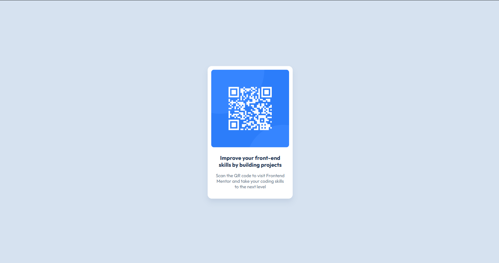

# Frontend Mentor - QR code component solution

This is a solution to the [QR code component challenge on Frontend Mentor](https://www.frontendmentor.io/challenges/qr-code-component-iux_sIO_H). Frontend Mentor challenges help you improve your coding skills by building realistic projects. 

## Overview

### Screenshot

### Links

- Solution URL: [Solution](https://your-solution-url.com)
- Live Site URL: [Live Site](https://kirtanpatel01.github.io/qr-code/)

## My process

### Built with

- HTML5
- CSS
- Flexbox

### Continued development

Use this section to outline areas that you want to continue focusing on in future projects. These could be concepts you're still not completely comfortable with or techniques you found useful that you want to refine and perfect.

## Author

- Website - [KJ_Patel Portfolio](https://kirtanpatel01.github.io/ARKA_WD_04)
- Frontend Mentor - [@kirtanpatel01](https://www.frontendmentor.io/profile/kirtanpatel01)
- Linkedin - [@yourusername](https://www.linkedin.com/in/kirtanpatel01)

